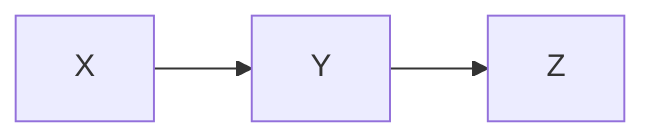
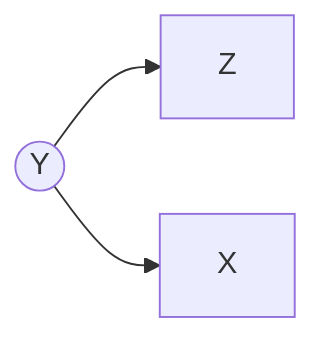
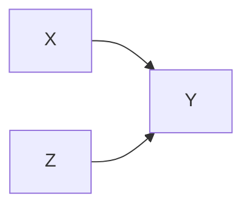
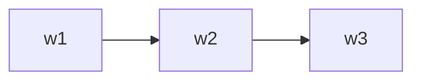
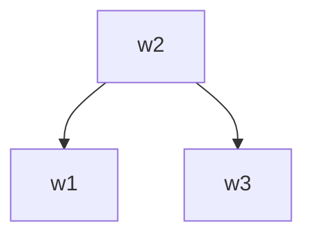
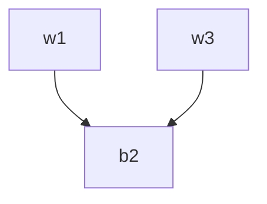
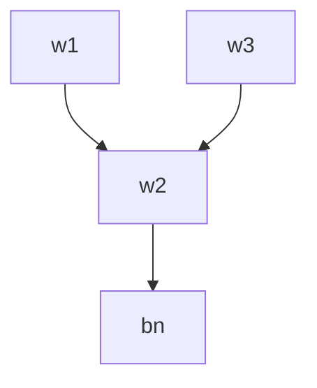

## Monte Carlo Tree Search

### Two Ideas

- Evaluation by rollouts: play multiple games to termination from 
  a state s (using a simple, fast rollout policy) and count wins and 
  losses
- Selective search: explore parts of the tree that will help improve 
  the decision at the root, regardless of depth

## UCB algorithm

$$
\text{UCB1}(n) = \frac{U(n)}{N(n)} + C \times \sqrt{\frac{\log N(\text{PARENT}(n))}{N(n)}}
$$

- N(n): the total number of rollouts from node n, which captures *how promising*
- U(n): the total number of wins for Player(Parent(n)), which captures *how uncertain*
- C: user-specified parameter, balance the weight we put in the two terms

## Three steps for MCTS UCT tree search

1. The UCB criterion is used to move down the layers of a tree from the root node until an unexpanded leaf node is reached.
2. A new child is added to that leaf, and we run a rollout from that child to determine the number of wins from that node.
3. We update the numbers of wins from the child back up to the root node.
whose behavior is just like a minimax agent
## Probability Rundown

the **chain rule**

$$
P(A, B) = P(A|B)P(B) = P(B|A)P(A)
$$
$$
P(A1, A2...Ak) = P(A1)P(A2|A1)...P(Ak|A1...Ak−1)
$$

When A and B are mutually independent, P(A, B) = P(A)P(B).
## Probabilistic Inference

其实就是条件的各种推论，没什么好讲的
##  Inference By Enumeration

In Inference By Enumeration, we follow the following algorithm:
1. Collect all the rows consistent with the observed evidence variables.
2. Sum out (marginalize) all the hidden variables. 
3. Normalize the table so that it is a probability distribution (i.e. values sum to 1)
其实就是枚举法，看上去似乎和边缘分布也有些联系

## Bayesian Network Representation

使用无环图(DAG)来展示关系,相比于表格，能计算更大更复杂的联合分布
We formally define a Bayes Net as consisting of:
- A directed acyclic graph of nodes, one per variable X. 
- A conditional distribution for each node P(X|A1 . . . An), where Ai is the ith parent of X, stored as a **conditional probability table** or CPT. Each CPT has n + 2 columns: one for the values of each of the n parent variables A1 . . . An, one for the values of X, and one for the conditional probability of X given its parents.
$$
P(X_1, X_2, \ldots, X_n) = \prod_{i=1}^{n} P(X_i \mid \text{parents}(X_i))
$$
## Structure of Bayes Nets
Two rules for Bayes Net independences
- Each node is **conditionally independent** of all its ancestor nodes (non-descendants) in the graph, given all of its parents.
- Each node is **conditionally independent** of all other variables given its **Markov blanket**.(A variable’s Markov blanket consists of parents, children, children’s other parents)
each node is conditionally independent of all its ancestor nodes in the graph, given all of its parents
$$
P(\text{var} \mid \text{Parents}(\text{var}), \text{Ancestors}(\text{var})) = P(\text{var} \mid \text{Parents}(\text{var}))
$$
## Exact Inference in Bayes Nets

### Variable Elimination

通过消除一个又一个的变量来求出目标变量的边缘分布

## Approximate Inference in Bayes Nets: Sampling

### Prior Sampling

从根节点开始，再从子节点开始。对每个结点计算并获取样本

### Rejection Sampling

从候选样本中通过特定条件来决定是否接受该样本

### Likelihood Weighting

对每一个样本设定一个权重

sampling a value if the variable is not an evidence variable, or changing the weight for the sample if the variable is evidence.

For example, suppose we want to calculate P(T | + c, +e). For the jth sample, we’d perform the following algorithm: 
- Set w j to 1.0, and c = true and e = true. 
- For T : This is not an evidence variable, so we sample t j from P(T ).
- For C: This is an evidence variable, so we multiply the weight of the sample by P(+c|t j), i.e. w j = w j · P(+c|t j). 
- For S: sample s j from P(S|t j). 
- For E: multiply the weight of the sample by P(+e| + c, s j), i.e. w j = w j · P(+e| + c, s j).

$$
\begin{equation}
P(z_1, z_2, \ldots, z_p, e_1, e_2, \ldots, e_m) = \prod_{i=1}^{p} P(z_i \mid \text{Parents}(z_i)) \cdot \prod_{i=1}^{m} P(e_i \mid \text{Parents}(e_i))
\end{equation}
$$

### Gibbs Sampling

让我们先来个Overview

In this approach, we first set all variables to some totally random value (not taking into account any CPTs). We then repeatedly pick one variable at a time, clear its value, and resample it given the values currently assigned to all other variables.

简单来讲就是对每一个变量依次进行条件采样，逐步构建整个系统的样本。

## D-Separation

We already mentioned that a node is conditionally independent of all its ancestor nodes in the graph given all of its parents.

We will present all three canonical cases of connected three-node two-edge Bayes’ Nets, or triples, and the conditional independence relationships they express.

### Casual Chains

上图便是**casual chain**,这展示了如下的关系

$$
P(x, y, z) = P(z \mid y) P(y \mid x) P(x)
$$

但是并不能保证X与Z是独立关系，如下所示

$$
P(y \mid x) = \begin{cases} 1 & \text{if } x = y \\ 0 & \text{else} \end{cases}
$$

$$
P(y \mid x) = \begin{cases} 1 & \text{if } x = y \\ 0 & \text{else} \end{cases}
$$

如果x=z,P(z|x)=1才成立，否则X与Z并不独立

但是我们可以在给定Y信息的情况下得到X⊥Z∣Y，基于条件独立性：

$$
P(X|Z,Y)=P(X∣Y)
$$

To summarize, in the causal chain chain configuration, X ⊥ Z|Y .

### Common Cause

上图便是**common cause**,这展示了如下的关系

$$
P(x, y, z) = P(x|y)P(z|y)P(y)
$$

就像causal chain一样

如果x=z,P(z|x)=1才成立，否则X与Z并不独立

$$
P(X|Z,Y)=P(X∣Y)
$$

### Common Effect

$$
P(x, y, z) = P(y|x, z)P(x)P(z)
$$

X and Z are independent if Y is **unobserved.** But if Y is observed, then knowing X will tell us the value of Z, and vice-versa. So X and Z are not conditionally independent given Y .

$$
P(Y \mid X, Z) = \begin{cases} 1 & \text{if } X = Z \text{ and } Y = \text{true} \\ 1 & \text{if } X \neq Z \text{ and } Y = \text{false} \\ 0 & \text{else} \end{cases}
$$

Common Effect can be viewed as **“opposite”** to Causal Chains and Common Cause

This same logic applies when conditioning on descendants of Y in the graph. If one of **Y ’s descendant nodes is observed**, as in Figure 7, X and Z are not guaranteed to be independent.

### General Case, and D-separation

**Given a Bayes Net G, two nodes X and Y , and a (possibly empty) set of nodes {Z1, . . . Zk} that represent observed variables, must the following statement be true: X ⊥⊥ Y |{Z1, . . . Zk}?**

**D-separation** (directed separation) is a property of the structure of the Bayes Net graph that implies this conditional independence relationship, and generalizes the cases we’ve seen above. If a set of variables Z1, · · · Zk d-separates X and Y , then X⊥Y|{Z1, · · · Zk} in all possible distributions that can be encoded by the Bayes net.

We start with an algorithm that is based on a notion of reachability from node X to node Y . (**Note: this algorithm is not quite correct! We’ll see how to fix it in a moment.**)

1. Shade all observed nodes {Z1, . . . Zk} in the graph.
2. If there exists an undirected path from X and Y that is not blocked by a shaded node, X and Y are “connected”.
3. If X and Y are connected, they’re not conditionally independent given {Z1, . . . Zk}. Otherwise, they are.

However, this algorithm only works if the Bayes’ Net has no Common Effect structure within the graph, because if it exists, then two nodes are “reachable” when the Y node in Common Effect is activated (observed). To adjust for this, we arrive at the following **d-separation algorithm**:

1. Shade all observed nodes {Z1, . . . , Zk} in the graph.
2. Enumerate all undirected paths from X to Y .
3. For each path:
	1. Decompose the path into triples (segments of 3 nodes).
	2. If all triples are active, this path is active and d-connects X to Y .
4. If no path d-connects X and Y , then X and Y are d-separated, so they are conditionally independent given {Z1, . . . , Zk}

A triple is active or inactive **depending on whether or not the middle node is observed.**

If all triples in a path are **active**, then the path is **active and d-connects** X to Y , meaning X is not guaranteed to be conditionally independent of Y given the observed nodes. If all paths from X to Y are **inactive**, then X and Y are **conditionally independent given the observed nodes**.

w means white(not observed),and b means black(observed).

Figures presented above are **Active triples**

